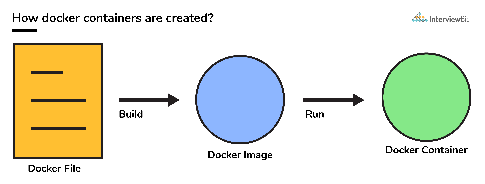

# Docker use code

## System Requirement

##### minimum system requirement

* Windows 11 64-bit: Home or Pro version 21H2 or higher, or Enterprise or Education version 21H2 or higher.
* Windows 10 64-bit: Home or Pro 2004 (build 19041) or higher, or Enterprise or Education 1909 (build 18363) or higher.
* Enable the WSL 2 feature on Windows. For detailed instructions, refer to the [Microsoft documentation](https://docs.microsoft.com/en-us/windows/wsl/install-win10).
* The following hardware prerequisites are required to successfully run WSL 2 on Windows 10 or Windows 11:
  * 64-bit processor with [Second Level Address Translation (SLAT)](https://en.wikipedia.org/wiki/Second_Level_Address_Translation)
  * 4GB system RAM
  * BIOS-level hardware virtualization support must be enabled in the BIOS settings. For more information, see [Virtualization](https://docs.docker.com/desktop/windows/troubleshoot/#virtualization-must-be-enabled).
* Download and install the [Linux kernel update package](https://docs.microsoft.com/windows/wsl/wsl2-kernel).

### What is Docker?

Docker is an open source platform for building, deploying, and managing containerized applications.

Docker is a software platform for building applications based on  *[containers](https://www.infoworld.com/article/3077875/containers-101-docker-fundamentals.html)* —small and lightweight execution environments that make shared use of the operating system kernel but otherwise run in isolation from one another. While containers have been used in Linux and Unix systems for some time, Docker, an open source project launched in 2013, helped popularize the technology by making it easier than ever for developers to package their software to “build once and run anywhere.”

### What are the advantages of using Docker container?

Here, are a major advantage of using Docker.

* Offers an efficient and easy initial set up
* Allows you to describe your application lifecycle in detail
* Simple configuration and interacts with Docker Compose.
* Documentation provides every bit of information.

### **What are the important features of Docker?**

Here are the essential features of Docker:

* Easy Modeling
* Version control
* Placement/Affinity
* Application Agility
* Developer Productivity
* Operational Efficiencies

### What is Docker image?

The Docker image help to create Docker containers. You can create the Docker image with the build command. Due to this, it creates a container that starts when it begins to run. Every docker images are stored in the Docker registry.

### **What is Docker Engine?**

Docker daemon or Docker engine represents the server. The docker daemon and the clients should be run on the same or remote host, which can communicate through command-line client binary and full RESTful API.

### **Explain Registries**

There are two types of registry is

* Public Registry
* Private Registry

Docker’s public registry is called Docker hub, which allows you to store images privately. In Docker hub, you can store millions of images.

### **How can you monitor the docker in production environments?**

Docker states and Docker Events are used to monitoring docker in the production environment.

### **What is a Container?**

A container is a standard unit of software bundled with dependencies so that applications can be deployed fast and reliably b/w different computing platforms.

* Docker can be visualized as a big ship (docker) carrying huge boxes of products (containers).
* Docker container doesn’t require the installation of a separate operating system. Docker just relies or makes use of the kernel’s resources and its functionality to allocate them for the CPU and memory it relies on the kernel’s functionality and uses resource isolation for CPU and memory, and separate namespaces to isolate the application’s view of the OS (operating system).




### Describe the lifecycle of Docker Container?

* **Created:** This is the state where the container has just been created new but not started yet.
* **Running:** In this state, the container would be running with all its associated processes.
* **Paused:** This state happens when the running container has been paused.
* **Stopped:** This state happens when the running container has been stopped.
* **Deleted:** In this, the container is in a dead state.


### How to use docker for multiple application environments?

* Docker-compose feature of docker will come to help here. In the docker-compose file, we can define multiple services, networks, and containers along with the volume mapping in a clean manner, and then we can just call the command “docker-compose up”.
* When there are multiple environments involved - it can be either dev, staging, uat, or production servers, we would want to define the server-specific dependencies and processes for running the application. In this case, we can go ahead with creating environment-specific docker-compose files of the name “docker-compose.{environment}.yml” and then based on the environment, we can set up and run the application.

### Differentiate between virtualization and containerization.


The question indirectly translates to explaining the difference between virtual machines and Docker containers.

| Virtualization                                                                                                                                                      | Containerization                                                                                                                                                                                                |
| ------------------------------------------------------------------------------------------------------------------------------------------------------------------- | --------------------------------------------------------------------------------------------------------------------------------------------------------------------------------------------------------------- |
| This helps developers to run and host multiple**OS** on the hardware of a single physical server.                                                             | This helps developers to deploy multiple**applications** using the same operating system on a single virtual machine or server.                                                                           |
| **Hypervisors** provide overall virtual machines to the guest operating systems.                                                                              | **Containers** ensure isolated environment/ user spaces are provided for running the applications. Any changes done within the container do not reflect on the host or other containers of the same host. |
| These virtual machines form an**abstraction of the system hardware** **layer **this means that each virtual machine on the host acts like a physical machine. | Containers form**abstraction of the application** **layer** which means that each container constitutes a different application.                                                                    |

### What command is used to check for the version of docker client and server?

* The command used to get all version information of the client and server is the `docker version.`
* To get only the server version details, we can run `docker version --format '{{.Server.Version}}'`

### How many Docker components are there?

There are three docker components, they are - Docker Client, Docker Host, and Docker Registry.

* **Docker Client:** This component performs “build” and “run” operations for the purpose of opening communication with the docker host.
* **Docker Host:** This component has the main docker daemon and hosts containers and their associated images. The daemon establishes a connection with the docker registry.
* **Docker Registry:** This component stores the docker images. There can be a public registry or a private one. The most famous public registries are Docker Hub and Docker Cloud.

### What is docker image registry?

* A Docker image registry, in simple terms, is an area where the docker images are stored. Instead of converting the applications to containers each and every time, a developer can directly use the images stored in the registry.
* This image registry can either be public or private and Docker hub is the most popular and famous public registry available.


### Dockerfile

* fire create a file with name of Dockerfile

```
FROM node:14.17.6
WORKDIR /app
COPY package.json .

ARG  NODE_ENV
RUN if [ "$NODE_ENV" = "development" ]; 
then npm install; 
else npm install --only=production; 
fi

COPY . ./
ENV PORT 3000
EXPOSE $PORT
CMD ["node" , "index.js"]
```

first line show the image after that show workdir after that copy the package.json file for the node_module

set the agrument of NODE_ENV for the development or production server use

copy all the app files

run on the port 3000

and last hit the command that run your node server

## Docker commands

#### Image Build

```
normal command 

docker build .

and full command is 

docker build -t docker-node .

```

#### Delete docker Image

`docker image rm image_ID`

#### List of Image

`docker image ls`

#### Run project

`docker run docker-node(project name)`

#### Show the name of project

`docker run -d --name node-app docker-node`

#### Set Port

`docker run -p 3000:3000 -d --name node-app docker-node`

#### Remove the Container

`docker rm node-app -f`

#### Show the app Directory

`docker exec -it node-app bash`

`ls`

`exit`

`cat index.js`

#### Check everything in your Docker

`docker ps`

`docker ps a`

#### Auto matic Save in file

`docker run -v %cd%:/app -p 3000:3000 -d --name node-app node-app-image`

#### Check logs in Docker

`docker logs node-app`

#### Delete node module detect

`docker run -v %cd%:/app -v /app/node_modules -p 3000:3000 -d --name node-app node-app-image`

## Docker Conatiner

```
version: '3'
services:
  node-app:
    build: .
    ports:
      - "3000:3000"
    environment:
      - PORT=3000
    # env_file:
    #   - ./.env
  mongo:
    image: mongo
    environment:
      - MONGO_INITDB_ROOT_USERNAME=root
      - MONGO_INITDB_ROOT_PASSWORD=mypass
```

first create a docker-compose.yml file and fill these details

#### Docker container Read Only

`docker run -v %cd%:/app:ro -v /app/node_modules -p 3000:3000 -d --name node-app node-app-image`

#### Pass Enviorment Variable

`docker run -v %cd%:/app:ro -v /app/node_modules --env PORT=3000 -p 3000:3000 -d --name node-app node-app-image `

add multiple enviorment variable

`docker run -v %cd%:/app:ro -v /app/node_modules --env-file ./.env  -p 3000:3000 -d --name node-app node-app-image`

#### Check Docker Volume

`docker volume ls`

#### Delete Docker volume

`docker volume prune`

#### Delete Container and volume

`docker rm node-app -fv`

#### Docker Compose Up

`docker-compose up -d`

`docker-compose up -d build `

`docker-compose -f docker-compose.yml -f docker-compose.dev.yml up -d --build`

#### Docker-compose.yml

```
version: '3'
services:
  node-app:
    build: .
    ports:
      - "3000:3000"
    environment:
      - PORT=3000
    # env_file:
    #   - ./.env
  mongo:
    image: mongo
    environment:
      - MONGO_INITDB_ROOT_USERNAME=root
      - MONGO_INITDB_ROOT_PASSWORD=mypass
```

#### docker-compose.dev.yml

```
version: '3'
services:
  node-app:
    build:
      context: .
      args:
        NODE_ENV: development
    # ports:
    #   - "3000:3000"
    volumes:
      - ./:/app
      - /app/node_modules
    environment:
      - NODE_ENV=development
    command: npm run dev
    # env_file:
    #   - ./.env
```

#### Docker Compose prod

```
version:'3'

services:

  node-app:

    build:

     context:.

    args:

    NODE_ENV:production

    # ports:

    #   - "3000:3000"

    environment:

    -NODE_ENV=production

    command:node index.js

    # env_file:

    #   - ./.env
```

#### Docker Compose backup.yml

```
version: '3'
services:
  node-app:
    build: .
    ports:
      - "3000:3000"
    volumes:
      - ./:/app
      - /app/node_modules
    environment:
      - PORT=3000
    env_file:
      - ./.env
```

#### Docker Compose Down

` docker-compose -f docker-compose.yml -f docker-compose.dev.yml down -v`The different stages of the docker container from the start of creating it to its end are called the docker container life cycle.

The most important stages are:
